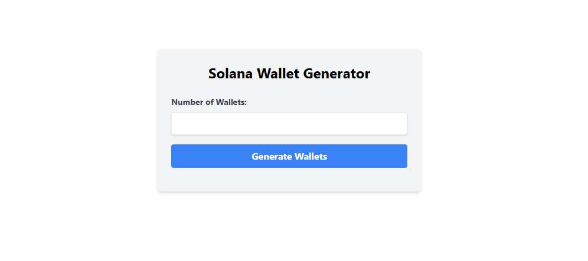

# Solana Wallet Generator

This application allows you to generate a specified number of Solana wallets. The generated wallets (public and secret keys) are stored locally in the `wallets` directory.



**SECURITY WARNING:** The `wallets` directory contains secret keys. **DO NOT** commit this directory to version control. It is included in the `.gitignore` file to prevent accidental commits. Handle these keys with extreme care. For production use, consider a secure key management solution.

## Prerequisites

- Node.js (v16 or higher recommended)
- npm (usually comes with Node.js)

## Installation

1.  **Clone the repository (if applicable):** If you have the code in a Git repository, clone it to your local machine. Since this is a WebContainer environment, you'll likely be starting from scratch or copying the code directly.
2.  **Install dependencies:**
    ```bash
    npm install
    ```

## Running the Application

1.  **Start the development server:**
    ```bash
    npm run dev
    ```
    This will start the React development server, typically on `http://localhost:5173`. The server will automatically reload when you make changes to the code.
2.  **Start the backend server (in a separate terminal):**
    ```bash
    npm start
    ```
    This will start the Node.js backend server, which listens for requests on `http://localhost:3001`.

## Usage

1.  Open your web browser and go to the address where the React development server is running (usually `http://localhost:5173`).
2.  Enter the number of wallets you want to generate in the input field.
3.  Click the "Generate Wallets" button.
4.  The generated wallets (public and secret keys) will be displayed on the page. They will also be saved as individual JSON files in the `wallets` directory in the project's root.

## Project Structure

- `server.js`: The Node.js backend server.
- `src/App.jsx`: The main React component containing the form and wallet display.
- `src/index.css`: Contains the `@tailwind` directives for Tailwind CSS.
- `index.html`: The main HTML file.
- `vite.config.js`: Configuration file for Vite.
- `tailwind.config.cjs`: Configuration file for Tailwind CSS.
- `postcss.config.cjs`: Configuration file for PostCSS.
- `package.json`: Contains project metadata and dependencies.
- `wallets/`: Directory where generated wallets are stored (created dynamically by the backend). **This directory should not be committed to version control.**
- `.gitignore`: Specifies files and directories to be ignored by Git.
- `README.md`: This file.

## Important Notes

- **Security:** This application is for development and testing purposes. For production environments, you should use a more secure method for storing and managing private keys. Never expose your secret keys in a public repository or production environment.
- **Error Handling:** The application includes basic error handling, but it can be further improved.
- **CORS:** The backend server enables CORS for all origins, which is suitable for development. For production, you should restrict CORS to specific origins.
- **Dependencies**: The project uses `@solana/web3.js` for Solana keypair generation, `express` for the backend, `axios` for making HTTP requests from the frontend, `vite` as the build tool, `react` and `react-dom` for the frontend, and `tailwindcss` for styling.
